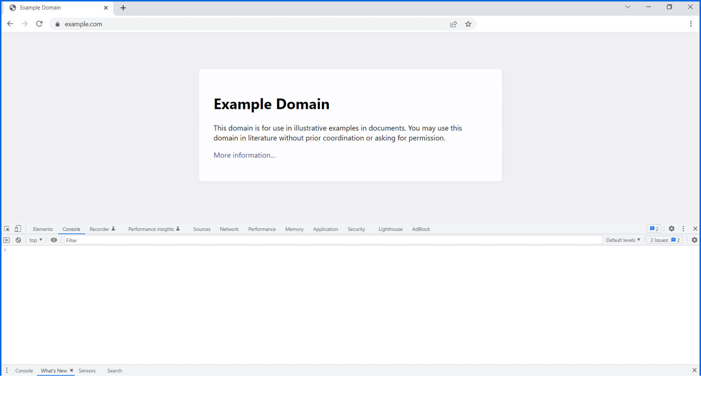

# Exercise: Capture Data

## Description

The aim of this exercise is to access the content of an element, specifically to use a button click to replace text.

## Task 1: The example.com website

Open the [example.com](https://exampledomain.github.io/capture-data/index.html) website in your browser. Open the developer tools and focus on the Console tab.

Example.com is a domain that can be used as an example in documents, papers and websites.

If you navigate in your browser to [example](http://www.example.com)  you will see a webpage with a simple message:

### Example Domain

This domain is established to be used for illustrative examples in documents. You may use this domain in examples without prior coordination or asking for permission.

## Task 2: Get h1 into a variable

Use the `document.querySelector()` method to query the h1 element on the page and assign it to the variable named `h1`.

## Task 3: Code an array

Declare a new variable, name it arr, and save the following array into it:

````html
[
    'Example Domain',
    'First Click',
    'Second Click',
    'Third Click'
]
````

## Task 4: Write a click-handling function

Write a new function declaration, named `handleClicks.` It should not accept any parameters.

Inside of it, code a `switch` statement, and pass a single parameter to it, `h1.innerText.`

The body of the switch statement should have a total of 4 cases (the fourth being the default case).

The first case should start with `case arr[0]:`. It should set the `h1.innerText` to `arr[1]`. In other words, it should assign the value of `arr[1]` to the `h1.innerText` property. The next line should have only the `break` keyword.

The second case should start with case `arr[1]:`. It should set the `h1.innerText` to `arr[2]`. In other words, it should assign the value of `arr[2]` to the `h1.innerText` property. The next line should have only the `break` keyword.

The third case should start with case `arr[2]:`. It should set the `h1.innerText` to `arr[3]`. In other words, it should assign the value of `arr[3]` to the `h1.innerText` property. The next line should have only the `break` keyword.

The `default` case should set the value of the `h1.innerText` property to `arr[0]`.

## Task 5: Add an event listener

You've created an `h1` variable in Task 2. Now, use that variable to run the `addEventListener()` method on it. Pass two arguments to the `addEventListener()` method: `'click'` and `handleClicks`.

## Solution: Capture Data



### Task 2 solution: Get h1 into a variable

````jvaascript
const h1 = document.querySelector('h1');
````

### Task 3 solution: Code an array

````jvaascript
const arr = [
    'Example Domain',
    'First Click',
    'Second Click',
    'Third Click'
];
````

### Task 4 solution: Write a click-handling function

````jvaascript
function handleClicks() {
    switch (h1.innerText) {
        case arr[0]:
            h1.innerText = arr[1];
            break;
        case arr[1]:
            h1.innerText = arr[2];
            break;
        case arr[2]:
            h1.innerText = arr[3];
            break;
        default:
            h1.innerText = arr[0];
    }
}
````

### Task 5 solution: Add an event listener

````javascript
h1.addEventListener('click', handleClicks);
````

<video src="PCWG5YEXTuulhuWBFz7roA_c41b0e4bb48a4179a40d685eed88f5e1_capture-data-solution-recording.mp4" controls title="Title"></video>
